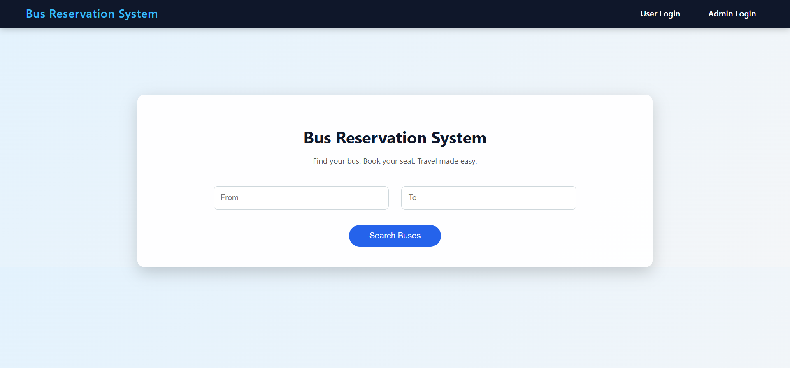
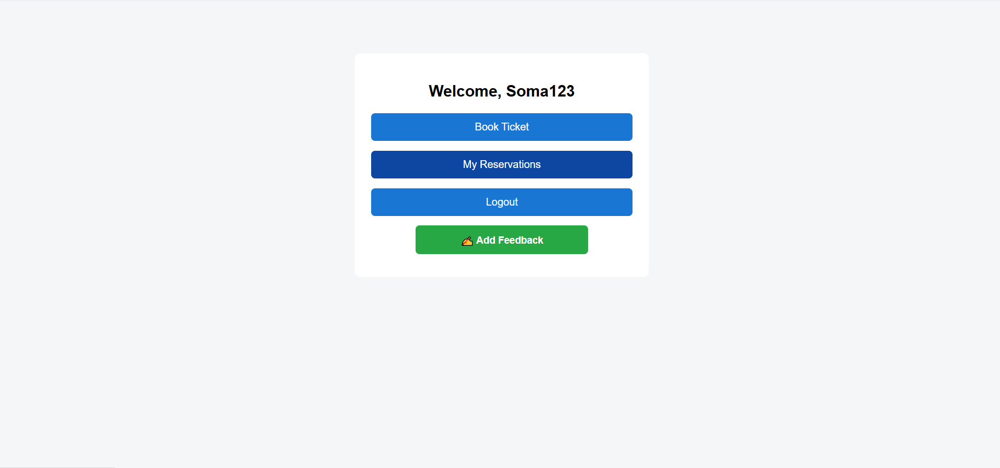
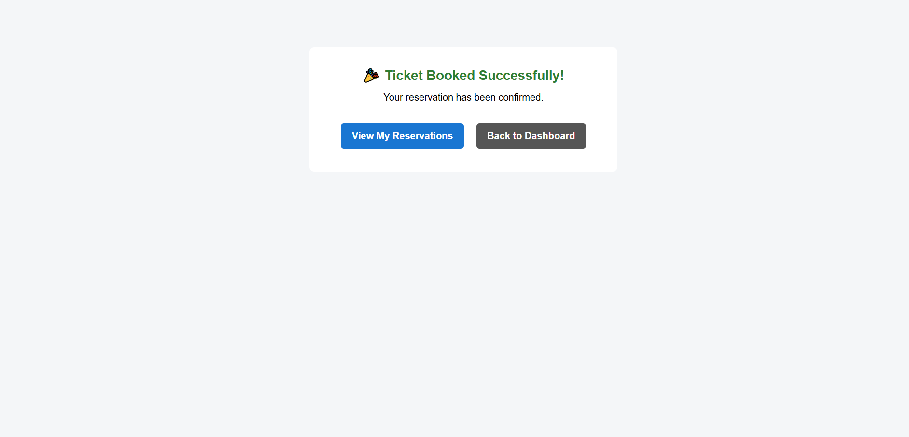
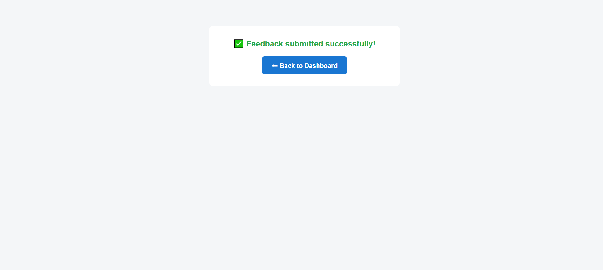

# 🚌 Bus Reservation System

A Full Stack Web Application built using **Spring Boot, Spring MVC, Spring Data JPA, JSP, and MySQL**.

This project allows users to search buses, book tickets, manage reservations, and submit feedback.  
Admins can manage routes, buses, view reservations, and monitor user feedback.

---

# 📖 Project Overview

The Bus Reservation System is a layered MVC-based web application developed to simulate a real-world bus booking platform.

The system contains two modules:

- 👤 User Module
- 🛠 Admin Module

The project follows proper Spring Boot architecture and best practices.

---

# 🏗 Architecture

The application follows **Layered MVC Architecture**:

```
Controller Layer  →  Service Layer  →  Repository Layer  →  Database
        ↓
     JSP (View Layer)
```

---

# 🛠 Technologies Used

- Java 17
- Spring Boot 5.0.1
- Spring MVC
- Spring Data JPA
- Hibernate ORM
- JSP & JSTL
- MySQL 8.1.0
- Maven
- Tomcat (Embedded Server)

---

# 🗄 Database Tables

 Entity Name  | Description |
|--------------|------------|
| **User**        | Stores registered user details such as username, password, and profile information |
| **Admin**       | Stores administrator login credentials |
| **Route**       | Contains route details including source, destination, and distance |
| **Bus**         | Stores bus information such as bus name, type, seat capacity, price, and availability |
| **Booking**     | Temporary booking details created when a user books seats |
| **Reservation** | Final confirmed booking records with status and booking date |
| **Feedback**    | Stores user feedback including journey date, ratings, and comments |

---

# 🔗 Entity Relationships

- User → One-to-Many → Reservation
- Bus → One-to-Many → Reservation
- Reservation → Many-to-One → User
- Reservation → Many-to-One → Bus
- Feedback → Many-to-One → User
- Feedback → Many-to-One → Bus

---

# 👤 User Module Features

1. User Registration  
2. User Login  
3. Search Buses (From → To)  
4. Book a Ticket  
5. Available Buses and Booking Bus
6. Booking Confirmation  
7. View My Reservations  
8. Cancel Reservation  
9. Submit Feedback  

---

# 🔄 User Booking Flow

1. User logs in
2. Searches buses
3. Clicks "Book"
4. Enters seat count
5. Reservation saved in database
6. Seats updated automatically
7. Redirected to success page
8. Visible in "My Reservations"

---

# 🛠 Admin Module Features

1. Admin Login  
2. Add / Edit / Delete Routes  
3. Add / Delete Buses  
4. View All Reservations  
5. View User Feedback  

---

# 🚀 How To Run

### 1. Clone the repository
```bash
git clone https://github.com/your-username/bus-reservation-system.git
```

---
### 2. Create Database
```sql
CREATE DATABASE bus_reservation_system;
```

---
### 3. Update MySQL credentials
Edit:
```
src/main/resources/application.properties
```

---
### 4. Run the project

Using Maven:

```bash
mvn spring-boot:run
```
OR run main class from IDE.

---
### 5. Open in browser
```
http://localhost:7383
```

---

#  Common Issues Faced & Solutions

### 1. Whitelabel Error (404)

Cause:
- Incorrect URL mapping

Fix:
- Added proper `@GetMapping` in controller

---

### 2. Ambiguous Mapping Error

Cause:
- Duplicate URL mappings

Fix:
- Changed endpoint paths

---

### 3. Feedback Not Showing

Cause:
- Incorrect model attribute name

Fix:
- Used correct attribute name in JSP

---

### 4. Admin Not Seeing Reservations

Cause:
- Service method not properly called

Fix:
```java
model.addAttribute("reservations",
    reservationService.getAllReservations());
```

---

### 5.Unknown Database Error

Cause:
- Database not created

Fix:
```sql
CREATE DATABASE bus_reservation_system;
```

---

# 📚 Concepts Implemented

- Spring Boot MVC
- Spring Data JPA
- Hibernate ORM
- JSP & JSTL
- Session Management
- CRUD Operations
- Entity Relationships
- MVC Architecture
- Exception Handling
- Debugging using logs
- MySQL Integration

---

# 🎨 UI Highlights

- Modern Navigation Bar
- Styled Login Forms
- Dashboard UI
- Responsive Tables
- Hover Effects
- Confirmation Dialogs
- Clean Layout Design

---
# Final Output

### 🏠 Home Page
<p align="center">
  
  
  
</p>

### 👤 User Module – Login & Dashboard
<p align="center">
  
  
  
</p>

### 🔍 Search & View Available Buses
<p align="center">
  
  
  
</p>

### 🚌 Ticket Booking Flow
<p align="center">
  
  
  
</p>

### 💬 Feedback System
<p align="center">
  
  
  
</p>

### 🛠 Admin Panel – Dashboard & Route Management
<p align="center">
  
  
  
</p>

### 🛣 Admin – Edit Route & Bus Management
<p align="center">
  
  
  
</p>

### ✏ Admin – Edit Bus
<p align="center">
  
</p>

---------------------
# 🧠 Learning Outcomes

Through this project:

- Understood complete MVC architecture
- Implemented full CRUD operations
- Managed relational database mappings
- Designed booking system logic
- Debugged real-world Spring Boot errors
- Built structured layered application
- Improved frontend styling using JSP & CSS

---

# 🔮 Future Enhancements

- Online Payment Integration
- Graphical Seat Selection
- JWT Authentication
- Role-based Security
- REST API Version
- React Frontend
- Docker Deployment
- Cloud Deployment (AWS)

---

# 📌 Project Status

✅ Fully Functional  
✅ User Module Working  
✅ Admin Module Working  
✅ Feedback Module Working  
✅ Reservation System Working  
✅ Database Integrated  
✅ Ready for Deployment  

---

## 👨‍💻 Author

**Developed by:**
**P. Soma Akash**  
Java Full Stack Trainee at [Codegnan](https://codegnan.com/)

---

# Acknowledgement
Grateful to my trainer [Sathya Prakash sir](https://github.com/sathyasoma) for invaluable guidance and support throughout my Java Full Stack training.

-----------
# ⭐ If You Like This Project

Give it a ⭐ on GitHub!
